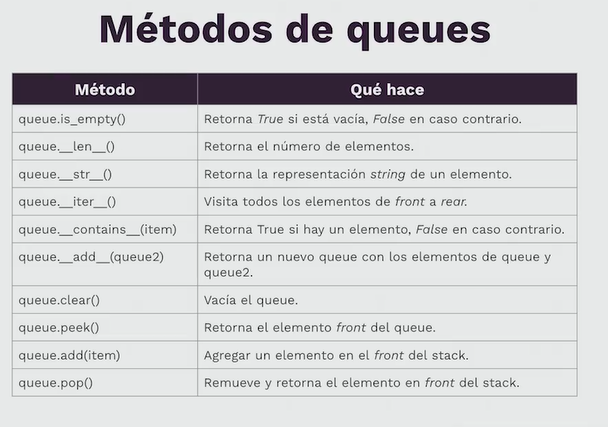

# Queues (Colas)

- FIFO (First In First Out)
- Rear: Último elemento
- Front: primer elemento

### Priority Queues

Se basan en FIFO con elementos de mayor/menor prioridad

### Operaciones fundamentales

- pop(): remover front
- add(): añadir a rear

## Métodos de stacks (en Python)

## Ejemplos

[Queue based on list](../queues/list_based_queue.py) [(Test here)](../queues/test_queue_based_list.py)

[Queue based on stacks](../queues/stack_based_queue.py) [(Test here)](../queues/test_queue_based_stacks.py)

[Queue based on nodes](../queues/node_based_queue.py) [(Test here)](../queues/test_queue_based_nodes.py)
