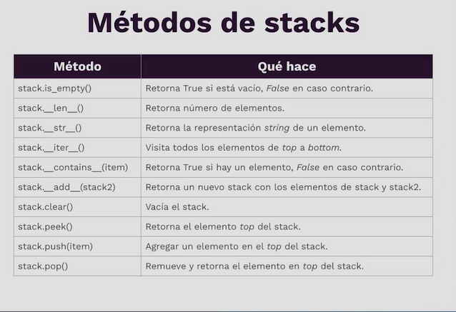

# Stacks (Pilas)

- Colección lineal
- Basados en arrays o linked list
- LIFO (Last In First Out)
- Añadir: push
- Remover: Pop
- Top
- Bottom

## Ejemplos de uso

- Invertir el orden de una lista
- Implementar "undo"
- Mantener historiales
- Backtracking

## Stack vs. list

- Similares pero no iguales
- List: append, pop
- La lista es afectada por sus otros métodos

## Métodos de stacks (en Python)

## Ejemplos

[Stack](../stacks/stack.py) [(Test here)](../stacks/test_stack.py)
